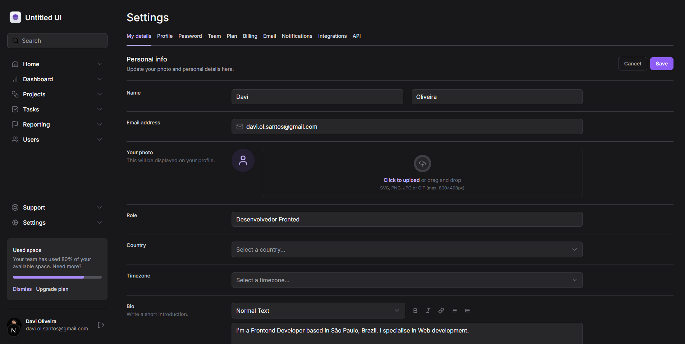
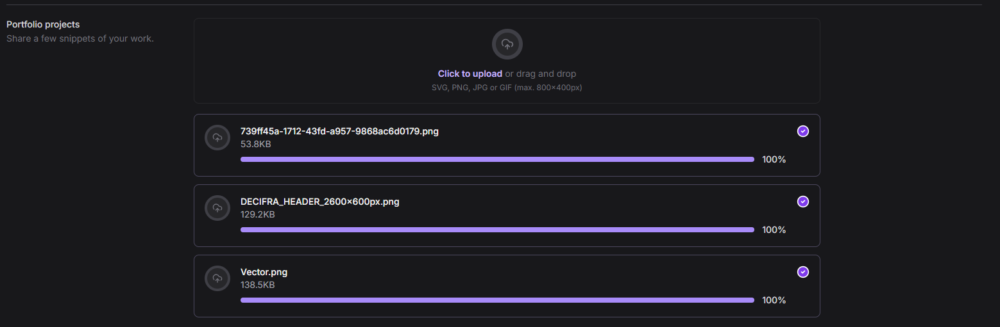
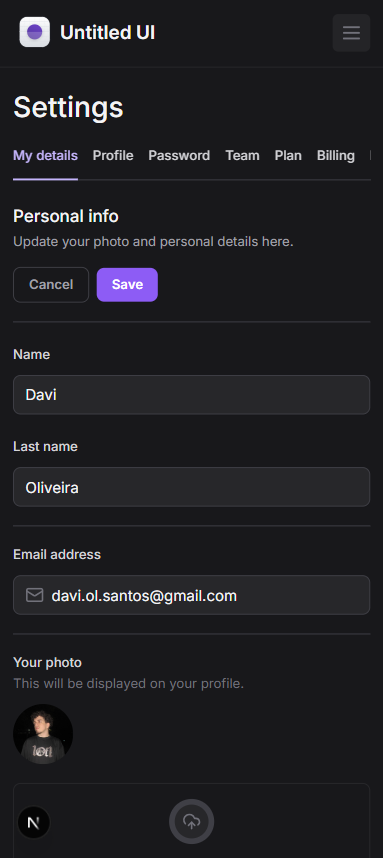

Ignite Tailwind

This was the project developed in Rocketseat's Mastering Tailwind course.

## Table of contents

- [Overview](#overview)
  - [Screenshots](#screenshots)
- [How to Run the Project](#how-to-run-the-project)
- [Developed with](#developed-with)
- [Author](#author)

## Overview

This was a project that simulates a profile settings page. It was built using Next.js, ShadCN for components, and Tailwind for styling. It includes a system to display the uploaded file and the uploaded photo.

### Screenshots

#### Desktop design



#### Active design



#### Mobile design



## How to Run the Project

To run the project locally, follow these steps:

1. Clone the repository:

   ```bash
   git clone "https://github.com/davsoliveira/ignite-tailwind"

   ```

2. Navigate to the project folder:

   ```bash
   cd ignite-tailwind

   ```

3. Install the dependencies:

   ```bash
   npm install

   ```

4. Start the development server:
   ```bash
   npm run dev
   ```

## Developed with

- Typescript
- Next.js
- Tailwindcss
- Shadcn UI

## Author

- GitHub - [davsoliveira](https://github.com/davsoliveira)
- My portfolio - [Davi Oliveira](https://davsoliveira.github.io/portfolio-davi/)
